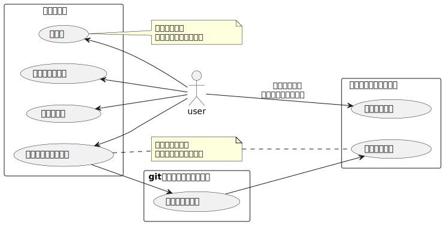
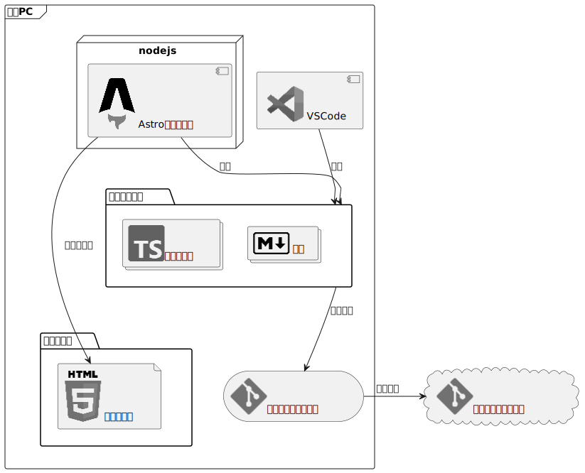

[前回](astro-tec-blog)からの続きで、開発環境について考えてみたいと思います。

## システムの構成
一般的に、静的サイトジェネレータを使ってサイトを製作・運用する場合、以下のようなシステムになると思われます。

処理自体はテスト環境で行ない、変更内容をリモートリポジトリにプッシュすると自動でホスティングサービスのサイトが更新されます。
サービスによっては、テスト環境でビルドしたファイルを手動でデプロイすることも可能です。

「テスト環境」部分をもう少し細かく考えてみます。
Astroを利用する場合はこのようなシステムになるはずです。


開発機に関連ファイルを保存し、VSCodeで編集します。同じく開発機でAstroの開発サーバを実行し、これは最新のソースを参照して自動更新されます。
開発サーバを起動しておけばソースを変更したら即時ブラウザの表示が更新され、エラーが発生した場合もすぐに確認ができます。
また、開発機でビルドを行った場合は開発機にビルド結果が保存されます。
プログラムと記事はgitでバージョン管理されており、変更内容をリモートリポジトリにプッシュすることで、あらかじめ設定したルールに従い自動でサイトが更新されます。

おそらく、以下のような流れで開発をすることが一般的なんだと思います。

- 開発者の個人PCにnode.jsをインストール
- 任意のフォルダをプログラムの保存場所とする
- VSCodeで保存場所と決めたフォルダを開く
- VSCodeのターミナルでその場所にAstroのプロジェクトを作成する
- そのままターミナルでAstroの開発サーバを起動する
- VSCodeでプログラム編集、git操作もVSCodeで実行
- ローカルでテストビルドをする場合はVSCodeのターミナルで実行する

ほとんど全てをVSCode上で実行できます。
処理結果の確認にブラウザが必要になりますが、それだってVSCodeでソースと並べて表示できたりします。
スマート。

### どうする？
ここまで言っておきながらアレですが、ローカルにサーバープログラムを入れたくなかったのでVPS上に環境を作りました。
元々開発環境用として使っているVPSを利用、図には記載していませんが、実際はdockerでnode.js環境を新しく作っています。


実作業では、VSCodeのリモート開発機能を使って、VPS上のフォルダをVSCodeで開いて編集します。
Astro開発サーバーの起動や各種ビルド処理などもVSCodeのターミナルで実行可能なので、ローカルでの開発とほぼ同様の開発が行なえます。

注意点としては、作業するにはVPSが起動していて、かつ開発機とVPSのネットワークが有効である必要がある（sshで接続しているため。ネットワークが死んでいたらサーバー上のファイルを開けない）ことでしょうか。
ネットワークが死んだら作業にならないというのは場合によっては気になるところですが、ローカル環境をほぼ汚さない、という点で満足しています。

## VPSでAstroを利用したWebサイト開発を行う
前提条件
- VPSでnode.jsを実行する環境が用意されていること
- VSCodeのリモート開発用の設定が完了していること

既に上記の準備が終わっていることを前提として、VPS上でAstroの開発サーバを起動してリモート開発を行う場合の簡単な手順は以下の通りです。

1. ひとまずsshでサーバーにログインしたら、VPS上の任意のディレクトリで``npm create astro@latest``コマンドを実行し、インストールウィザードを使ってプロジェクトを新規作成します。
1. VSCodeのリモートエクスプローラで、新しく作られたプロジェクト用のディレクトリを開きます。
1. デフォルトでは、開発サーバはlocalhostでしか見れません（外部ネットワークから開発サーバを参照できない）。そのため開発サーバを外部ネットワークから参照できるように設定を変更する必要があります。
``package.json``を開き以下の通り変更します。``--host``はlocalhost以外からも見れるように開発サーバを公開するためのオプションです[^1]。
   ```json title="package.json" del={2} ins={3}
     "scripts": {
       "dev": "astro dev",
       "dev": "astro dev --host",
   ```
1. 保存したら、VSCodeのターミナルから``npm run dev``を実行します。
1. ブラウザを開き、``http://（VPSのアドレス）:4321/``にアクセスします[^2]。
1. 以下、ローカルの場合と同じように開発を行います。
1. VSCode終了前にはターミナルに起動している開発サーバを``ctrl+c``で終了させます。


[^1]: 公式の日本語ドキュメントより、「[CLIコマンド | Docs](https://docs.astro.build/ja/reference/cli-reference/)」 参照
[^2]: 必要に応じて、ファイアウォールの設定変更などが必要です。
ポート番号を変更したい場合は上記ドキュメントのastro devのオプションで説明されています。

### 注意事項
Astroの開発サーバは、あくまで開発用であり一般公開するためのシステムではありません。
何らかの形でアクセス制限を掛けるべきだし、開発していないときはアクセスできないようにすべきでしょう。

## 所感など
情報を集めて検討している段階では「なんとなくわかるけど実体感がない」というか想像でしかない感じでしたが、実際に開発環境を構築して開発サーバーを起動し修正をしてみたことで、一気に掴める感じになりました。
VPSとdockerとVSCodeで開発環境作ったのも正直初めてなんですが、開発体験はローカル開発と遜色ないように思えます（開発サーバー起動にdockerコンテナ内に入る必要があるのがちょっと面倒か）。
そしてプログラムを修正したら開発サーバが即反映されてエラー起きた時に詳細出てくれるのがありがたいですね！ちょっと感動しました。

懸念点としては、今は環境構築段階なのでVPS上のファイルを直接書き換えてプレビューするのも問題ないですけど、ブログの運用段階に入ってからプレビューを見たい場合に開発サーバを起動するのが面倒になりそうな気がしなくもないところでしょうか。
やっぱり編集画面から簡単にプレビューできるCMSの方が使い勝手はいいんだろうなあ…


### 今後の予定
ということで、改めて、近いうちに記事に残しておきたい情報はこんな感じでしょうか。

- gitの運用について
- 採用したテーマと追加した機能
- 動的要素への対応をどうするか
- ホスティング

VPSやdockerについてもまとめたいんですけど、ちょっと検索すれば自分が欲しい情報はすぐ見つかる感じだし、そんな中あえてまとめるほど理解度が高いかというと全く自信がないのでどうしようかな…


<!--
## 気になる点
- 学習コストが低いとはいえnode.jsやtypescriptの知識は必須！慣れないと大変…
- フレームワークではあるけど自由度が高いので気を付けないと運用していくうちに腐りそう
- git必須でモバイルからの更新とか何それおいしいの状態
- 記事とシステムでリポジトリを分けたい
-->
