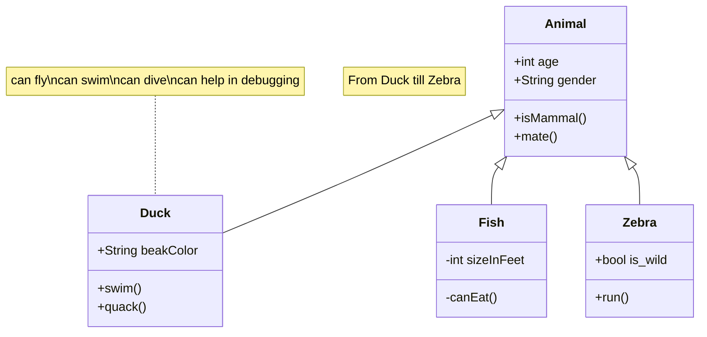

## This is a H2 Heading

### This is a H3 Heading

#### This is a H4 Heading

##### This is a H5 Heading

###### This is a H6 Heading

## Horizontal Rules

---

---

---

## Emphasis

**This is bold text**

_This is italic text_

~~Strikethrough~~

## Quotes

"Double quotes" and 'single quotes'

## Blockquotes

> Blockquotes can also be nested...
>
> > ...by using additional greater-than signs right next to each other...

## References

An example containing a clickable reference[^1] with a link to the source.

Second example containing a reference[^2] with a link to the source.

[^1]: Reference first footnote with a return to content link.
[^2]: Second reference with a link.

If you check out this example in `src/content/post/markdown-elements/index.md`, you'll notice that the references and the heading "Footnotes" are added to the bottom of the page via the [remark-rehype](https://github.com/remarkjs/remark-rehype#options) plugin.

## Lists

Unordered

- Create a list by starting a line with `+`, `-`, or `*`
- Sub-lists are made by indenting 2 spaces:
  - Marker character change forces new list start:
    - Ac tristique libero volutpat at
    - Facilisis in pretium nisl aliquet
    - Nulla volutpat aliquam velit
- Very easy!

Ordered

1. Lorem ipsum dolor sit amet
2. Consectetur adipiscing elit
3. Integer molestie lorem at massa

4. You can use sequential numbers...
5. ...or keep all the numbers as `1.`

Start numbering with offset:

57. foo
1. bar

## Code

Inline `code`

Indented code

    // Some comments
    line 1 of code
    line 2 of code
    line 3 of code

Block code "fences"

```
Sample text here...
```

Syntax highlighting

```js
var foo = function (bar) {
	return bar++;
};

console.log(foo(5));
```

```js
// 変数
var foo = function (bar) {
	return bar++;
};

console.log(foo(5));
```

### Expressive code examples

Adding a title

```js title="file.js"
console.log("Title example");
```

A bash terminal

```bash
echo "A base terminal example"
```

Highlighting code lines

```js title="line-markers.js" del={2} ins={3-4} {6}
function demo() {
	console.log("this line is marked as deleted");
	// This line and the next one are marked as inserted
	console.log("this is the second inserted line");

	return "this line uses the neutral default marker type";
}
```

[Expressive Code](https://expressive-code.com/) can do a ton more than shown here, and includes a lot of [customisation](https://expressive-code.com/reference/configuration/).

### Integration with Expressive Code

For more usage, please refer to the official website [expressive-code](https://expressive-code.com/).

```js title="line-markers.js" del={2} ins={3-4} {6}
function demo() {
  console.log('this line is marked as deleted')
  // This line and the next one are marked as inserted
  console.log('this is the second inserted line')

  return 'this line uses the neutral default marker type'
}
```

### Code folding is supported by default

```js
var myArr = [1,2]
console.log(myArr)

var myObj = {a: 1, b: 2}

for(let key of myArr){
  console.log(key)
}

var it = myArr[Symbol.iterator]()
it.next() // {value: 1, done: false}

// VM704:12 Uncaught TypeError: myObj is not iterable
for(let key of myObj){
  console.log(key)
}

```

## Tables

| Option | Description                                                               |
| ------ | ------------------------------------------------------------------------- |
| data   | path to data files to supply the data that will be passed into templates. |
| engine | engine to be used for processing templates. Handlebars is the default.    |
| ext    | extension to be used for dest files.                                      |

Right aligned columns

| Option |                                                               Description |
| -----: | ------------------------------------------------------------------------: |
|   data | path to data files to supply the data that will be passed into templates. |
| engine |    engine to be used for processing templates. Handlebars is the default. |
|    ext |                                      extension to be used for dest files. |


## Links

[Content from markdown-it](https://markdown-it.github.io/)

## image

### Display remote links

```md

```


### Show Local Pictures

```md

```


### Customize Local Images

Use html, set`style="width: 200px;"`

```html

```


### One row, two columns.

```markdown
:::classadd{.image-cols-2}
- 
- 
:::
```
:::classadd{.image-cols-2}
- 
- 
:::


### One row, three columns

```markdown
:::classadd{.image-cols-3}
- 
- 
- 
:::
```
:::classadd{.image-cols-3}
- 
- 
- 
:::


### One row, four columns

```markdown
:::classadd{.image-cols-4}
- 
- 
- 
- 
:::
```
:::classadd{.image-cols-4}
- 
- 
- 
- 
:::

### Actually, it's all right.

You can actually display it however you want, you just need to know a little bit about TailwindCss.

```markdown
:::classadd{.image-cols-2}
- 
- 
- 
:::
```
:::classadd{.image-cols-2}
- 
- 
- 
:::


### Remember

The theme provides three simple style classes that you can use directly.

+ One row and two columns: `class="image-cols-2"`.
+ one row and three columns: `class="image-cols-3"`.
+ one row and four columns: `class="image-cols-4"`.

If you want a more complex display, check out TailwindCss.


## callout

````markdown
:::tip[Customized Title]
hello world
:::

:::note
note

```js
console.log(hello world)
```

:::

:::caution
caution
:::

:::danger
danger
:::

````

:::tip[Customized Title]
hello world
:::

:::note
note

```js
console.log(hello world)
```

:::

:::caution
caution
:::

:::danger
danger
:::

## option style
### Support mermaid

Use:

+ start with **```mermaid**
+ end with **```**
+ set markdown frontmatter `mermaid: true`.

Mermaid Code:

```html title="mermaid.md"
classDiagram
    note "From Duck till Zebra"
    Animal <|-- Duck
    note for Duck "can fly\ncan swim\ncan dive\ncan help in debugging"
    Animal <|-- Fish
    Animal <|-- Zebra
    Animal : +int age
    Animal : +String gender
    Animal: +isMammal()
    Animal: +mate()
    class Duck{
        +String beakColor
        +swim()
        +quack()
    }
    class Fish{
        -int sizeInFeet
        -canEat()
    }
    class Zebra{
        +bool is_wild
        +run()
    }
```

Result:



### Support Mathjax

+ set markdown frontmatter `mathjax: true`.

```yaml title="Mathjax.md"
---
mathjax: true
---
$$ \displaystyle\sum_{i=0}^N\int_{a}^{b}g(t,i)\text{d}t $$
```

$$ \displaystyle\sum_{i=0}^N\int_{a}^{b}g(t,i)\text{d}t $$
